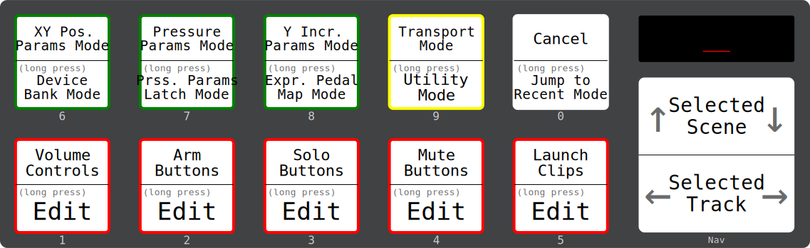
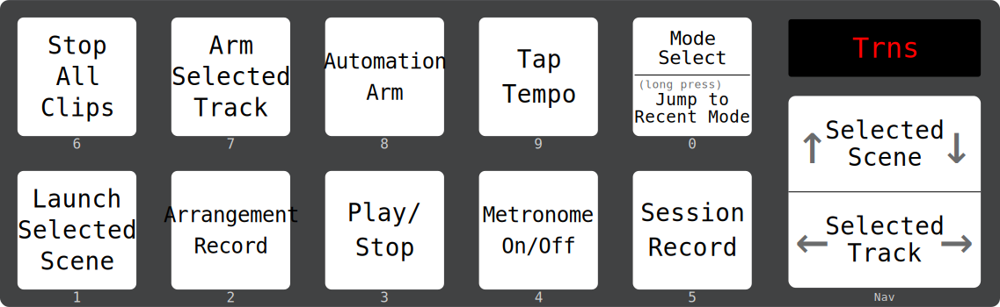
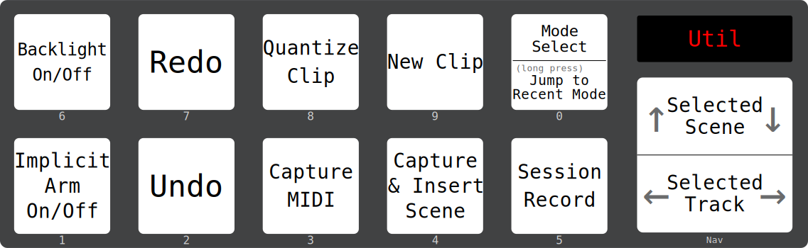
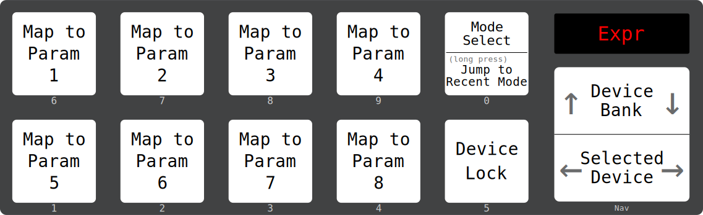
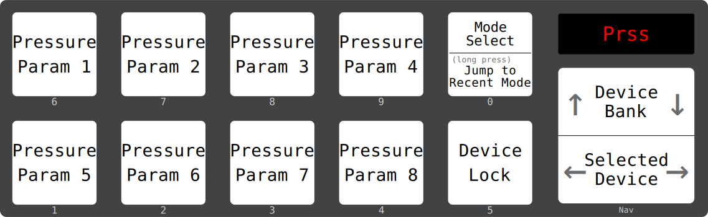
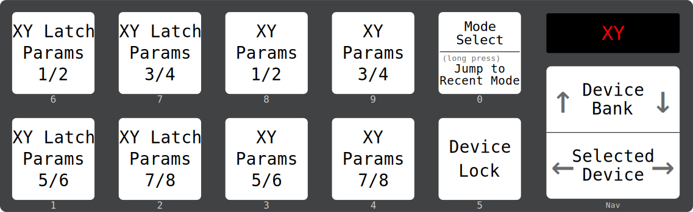
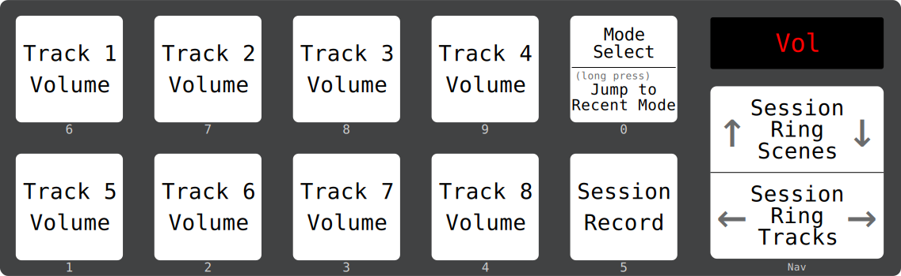
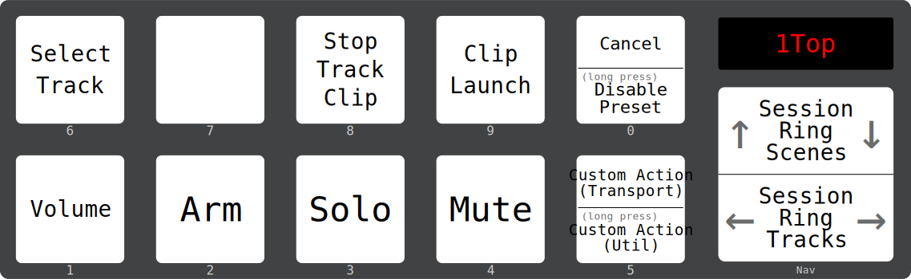

# modeStep

This is an Ableton Live 12 Control Surface script for the [SoftStep
2](https://www.keithmcmillen.com/products/softstep/).

It lets you control transport, device parameters, clips, mixer
controls, and more. It provides realtime feedback via the SoftStep's
LEDs and display.

The interface is [highly configurable](#python-configuration), so you
can arrange things in a way that makes sense for you.

You can also [switch back and forth](#standalone-presets) between
modeStep and your own SoftStep standalone presets.

## Installation

### Live

- Clone or download this repo and place it in your Live User Library
  under the `Remote Scripts/` directory. If you download it directly,
  make sure to change the folder name from `modeStep-main` to
  `modeStep` (or anything without a hyphen).
- (Re)start Live, and go to `Link, Tempo & MIDI` in Preferences.
- Choose `modeStep` as one of your control surfaces, and select the
  main SoftStep port (generally `SoftStep (Control Surface)` or
  `SoftStep`) for the Input and Output.
- In the section with Track/Sync/Remote/MPE checkboxes:
  - **for most users:** ensure that all checkboxes are disabled
    for the modeStep input/output ports.
  - **if you're using any [standalone presets](#standalone-presets):**
    ensure that the Remote checkbox is enabled for the modeStep input port,
    and that all other checkboxes are disabled for the modeStep input/output
    ports.

### SoftStep 2

No presets or special configuration are required on the SoftStep -
just make sure your device firmware is up to date (v2.0.3 or newer).
The controller will be placed into hosted mode.

## Intro

[Transport Mode](#transport-mode) will be active when Live is started,
indicated by `Trns` on the SoftStep's screen. Try pressing key 3 to
play/stop the transport.

<a name='mode-select'></a>From any mode, you can press key 0 to open 
the Mode Select screen, and choose where you want to go:



## <a name='modes'/>Modes

### <a name='transport-mode'/>Transport Mode

_[Mode Select](#mode-select): Key 9_



### <a name='utility-mode'/>Utility Mode

_[Mode Select](#mode-select): Key 9 (Long Press)_



Implicit Arm refers to automatic arming of the selected track
(a.k.a. the "pink arm button"). If you have other implicit-arming
control surfaces (e.g. Push), they may interfere with the selected
behavior.

### <a name='device-parameters-increment-mode'/>Device Parameters Y Increment Mode

_[Mode Select](#mode-select): Key 8_


Press the top/bottom of a key to increment/decrement the parameter.

### Expression Pedal Map Mode

_[Mode Select](#mode-select): Key 8 (long press)_

Maps your expression pedal to a numbered device parameter. This
selects a parameter _slot_ rather than the parameter itself - i.e. if
a new device is selected, the expression pedal will control the same
slot on the new device.



### <a name='device-parameters-pressure-mode'/>Device Parameters Pressure/Pressure Latch Modes

_[Mode Select](#mode-select): Key 7 / Key 7 (Long Press)_



Provides pressure-sensitive pedals which control the current
device. In the latch mode, the parameter retains its value when you
release the pedal.

### Device Parameters XY Position Mode

_[Mode Select](#mode-select): Key 6_



The left half are latching controls which retain their values when
released.

### Device Bank Mode

_[Mode Select](#mode-select): Key 6 (Long Press)_


### <a name='track-controls'/>Track Controls

_[Mode Select](#mode-select): Keys 1-5_

These modes control 4 or 8 tracks within the session ring ("red
box"). For example, pressing key 1 on the Mode Select screen opens:



By default, all of these modes control a single parameter across 8
tracks, except the clip launch mode which controls a 2x4 box. Key 5 is
assigned to session record.

You can customize the track controls modes using
`override_track_controls` in your
[configuration](#python-configuration), or [edit them 
directly](#editing-track-controls) if you need a different layout 
in the moment.

## Advanced Usage

_(click section headers to expand)_

<details>

<summary><a name='python-configuration'/><h3>[+] Configuration</h3></summary>

You can customize modeStep by creating a file called `user.py` in this
directory.

See [configuration.py](control_surface/configuration.py) for a full
list and description of available options, and
[types.py](control_surface/types.py) for valid values for mode names
and other literals. For example:

```python
# user.py
from .control_surface.configuration import Configuration, override_nav

configuration = Configuration(
    initial_mode="track_controls_5",
    key_safety_strategy="single_key",
    override_elements: {
        "transport": [
            override_nav(horizontal="session_ring_tracks", vertical="session_ring_scenes")
        ]
    },
    # ...
)

```
#### Set-specific configuration

You can configure modeStep on a set-by-set basis by creating a clip
anywhere in the session view with a name like:

```text
ms={"initial_mode": "device_parameters_pressure"}
```

or:

```text
ms<{"initial_mode": "device_parameters_pressure"}
```

The part after `ms=` or `ms<` should be a valid JSON string, which
will be converted to parameters for the `Configuration`.

Using `ms=` will override all configuration from your `user.py`. `ms<`
will preserve configuration from `user.py`, but override any specified
fields.

Configuration is only loaded when a set is opened, so you'll need to
save and re-open the set after creating this clip. Triggering or
otherwise interacting with the clip doesn't do anything special.
</details>

<details>
<summary><a name='editing-track-controls' /><h3>[+] Live-Editing Track Controls</h3></summary>

You can modify track controls for the current session directly from
the SoftStep (for persistent changes, use the 
[configuration file](#python-configuration)). To do this, long-press 
one of keys 1-5 on the Mode Select screen. You'll be prompted to 
choose the control for the top row of pedals:



_See below for notes on action customization via key 5._

After selecting a control for the top row, you'll be prompted to
choose the control for the bottom row in the same way.

If you choose different controls for the top and bottom rows, you'll
have access to both controls across 4 tracks. The display will show
the first two letters from each control. For example, if you choose
**Solo** and **Arm**:


If you choose the same control twice, you'll have access to 8
tracks. For example, if you choose **Mute** twice:


#### Selecting the Key 5 Action

Key 5 is normally mapped to session record in track controls modes,
but this can be configured. Press key 5 from the top or bottom edit
screen to assign a different action. `1Act` (or similar) will appear on
the display, and you can press keys 1-9 to select an action. The
layout mirrors the [Transport Mode](#transport-mode) layout - so if
you want to map `Play/Stop`, for example, touch key 3.

Long-pressing does the same thing, but with actions from the [Utility
Mode](#utility-mode) layout.

#### Disabling Track Controls Modes

If you want to remove clutter from your Mode Select screen, press and
hold key 0 while editing a track controls mode to disable it. This
disables the corresponding LED on the mode select screen. You can
still reconfigure the mode by long-pressing the corresponding key on
the mode select screen.
</details>

<details>
<summary><a name='standalone-presets'/><h3>[+] Standalone Presets</h3></summary>

modeStep can put the SoftStep into standalone mode and load any
presets in your setlist.

This functionality needs to be configured manually in your
[`user.py`](#python-configuration) file by overriding one or more
buttons on the mode select screen:

```python
# user.py
from .control_surface.configuration import Configuration

configuration = new Configuration(
  # Map Mode Select button 5 to setlist programs 1/2 on short/long press.
  override_modes={5: ("standalone_1", "standalone_2")}
)
```

With this configuration, if you press key 5 on the Mode Select screen,
modeStep will place the hardware into standalone mode, send program
change 1, and relinquish control of the LEDs and display.

To get back to modeStep while in standalone mode, configure a button
in your preset with the `Foot On` source bound to `CC 80 (channel
1)`. Key 0 is recommended, to match the layout of other modes. As
usual, a short press will jump to the Mode Select screen, and a long
press will jump to the most-recent other mode.

All other MIDI messages will be ignored by modeStep while the
controller is in standalone mode. You can bind your controls using
normal MIDI mappings in Live. However, you should avoid using certain
CCs in your MIDI mappings:

- avoid `CCs 40-86 (channel 1)`, since the SoftStep uses these
  controls to send sensor data while in hosted mode.
- avoid `CCs 20-29, 40-42, 50-53, and 110-119 (any channel)`, since
  mapping these might cause Live to send feedback that interferes with
  the SoftStep's LEDs and display.

When using standalone presets, make sure that the `Remote` checkbox 
is enabled for the modeStep MIDI input in Live's settings.

_Note: if you're having issues with LED states being overwritten when
switching in and out of standalone mode, make sure to set a
`background_program` in your configuration._
</details>
